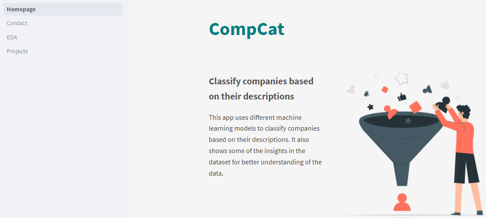

# Streamlit-based Company Category Classification App 
#### Data Science MSC Project

## 1) Overview


This repository consist of one of my inquisitiveness to using making machine better the life of all. This propject features template code designed to enable users to perform Company Categorization (CompCat) using a dynamic model that frequently updates and accurately categorizes companies based on their description. This tool can be used to identify changes in the data over time and facilitate targeted interventions. The project is built using the [Streamlit](https://www.streamlit.io/)Streamlit web application framework, ensuring a streamlined and user-friendly experience.


#### 1.1) Description of contents

Below is a high-level description of the contents within the CompApp:

| File Name                             | Description                                                       |
| :---------------------                | :--------------------                                             |
| `streamlit`                           | Base Streamlit application definition.                             |
| `pages/Homepage.py/`                  | consists of the introduction of the app with a logo        | 
| `pages/Contact.py/`                   | contains a short form to contact the developer of the app         |
| `pages/Projects.py/`                  | contains the insights, and different models page         |
| `resources/data/`                     | Sample data used to demonstrate app functioning.                  |
| `resources/models/`                   | Folder to store model and data binaries if produced.              |
| `resources/img/`                      | Folder to hold image for the Streamlit app |

## 2) Usage Instructions


#### 2.1) Running the clv_app system locally

As a first step to becoming familiar with our web app's functioning, we recommend setting up a running instance on your local machine.

To do this, follow the steps below by running the given commands within a Git bash (Windows), or terminal (Mac/Linux):

 1. Ensure that you have the prerequisite Python libraries installed on your local machine using the requirement.txt:

 ```bash
 pip install -r requirements.txt
 ```

 2. Clone the repo to your local machine.

 ```bash
 Download all the folders listed above inside one folder
 ```  

 3. Navigate to the base of the cloned repo, and start the Streamlit app.

 ```bash
 cd Multi_classification\pages/
 streamlit run Homepage.py
 ```

 If the web server was able to initialise successfully, the following message should be displayed within your bash/terminal session:

```
  You can now view your Streamlit app in your browser.

  Local URL: http://localhost:8501
  Network URL: http://192.168.142.162:8501
```

You should also be automatically directed to the base page of your web app. This should look something like this:



Congratulations! You've now officially deployed our CLV app!

Now we can navigate through the different sections of the streamlit to see its functionality.  


## 3) FAQ

This section of the repo will be periodically updated to represent common questions which may arise around its use. If you detect any problems/bugs, please [create an issue](https://help.github.com/en/github/managing-your-work-on-github/creating-an-issue) and we will do our best to resolve it as quickly as possible.

We wish you all the best with interacting with our app :rocket:

